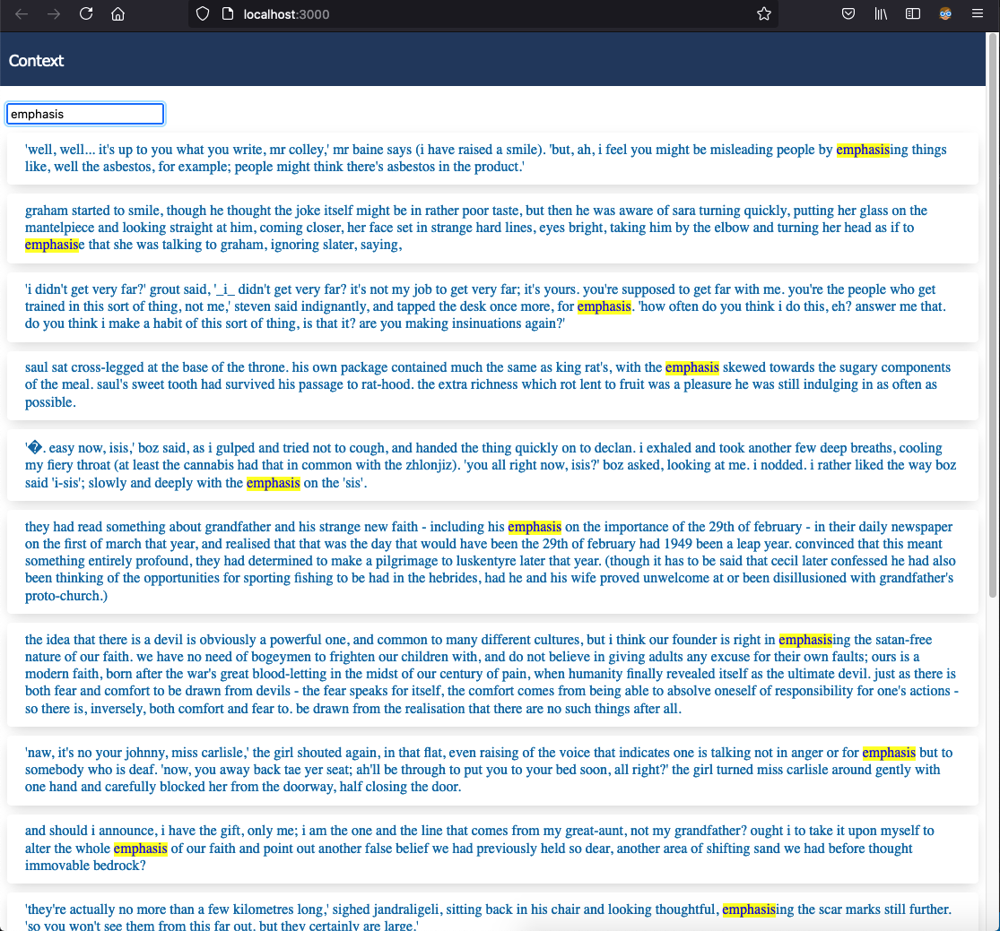

# context
this example can be helpful for understanding the meaning of sentences

how to use:

cd ./context/db_service

put some books (.txt) in ./context/db_service/data_sources

// prepare data in db, we need python 3
pip install tqdm
python3 ./main.py

// start server
cd ./context/server
npm install
node ./index.js

// start web app
cd ./context/web_client/src
npm install
npm start

try http://localhost:3000/

## Visual Examples

Contact me either by email (khominvladimir@yandex.ru) or Skype (fedorgolyb)
